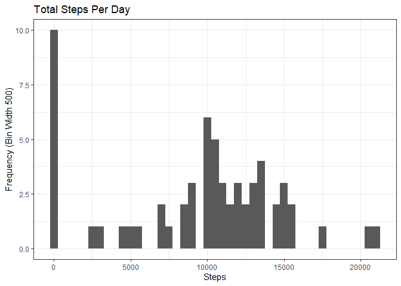
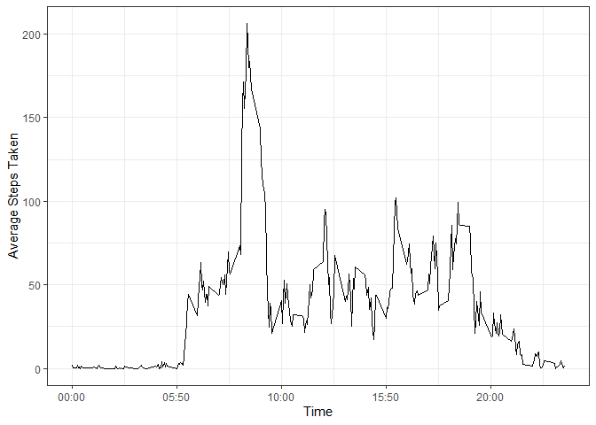
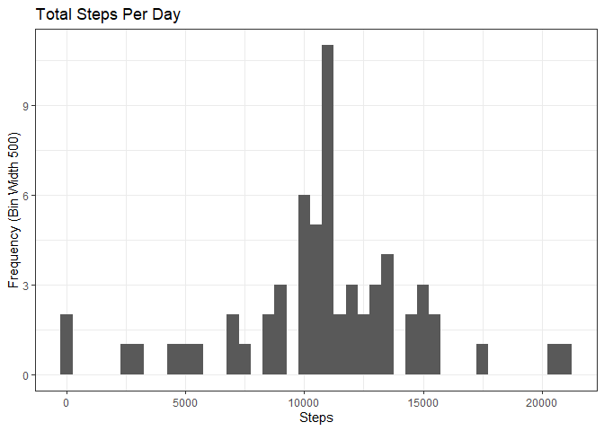

## Loading and preprocessing the data

```r
library("data.table")
library("ggplot2")
library(scales)
library(Hmisc)

# comment these lines out if wd already local or not run from source()
thisdir <- getSrcDirectory(function(x) {
    x
})
setwd(thisdir)


# load, unzip data into data directory if needed
dir.create(file.path(".", "data"), showWarnings = FALSE)
data_filename = "data/data.zip"
if (!file.exists(data_filename)) {
    data_url <-
        "https://d396qusza40orc.cloudfront.net/repdata%2Fdata%2Factivity.zip"
    download.file(data_url, destfile = data_filename)
    unzip("data/data.zip", exdir = "./data")
}
data_dir <- "./data"

activity <- fread(file.path(data_dir, "activity.csv"))
summary(activity)
```

```
##      steps            date              interval     
##  Min.   :  0.00   Length:17568       Min.   :   0.0  
##  1st Qu.:  0.00   Class :character   1st Qu.: 588.8  
##  Median :  0.00   Mode  :character   Median :1177.5  
##  Mean   : 37.38                      Mean   :1177.5  
##  3rd Qu.: 12.00                      3rd Qu.:1766.2  
##  Max.   :806.00                      Max.   :2355.0  
##  NA's   :2304
```

## What is mean total number of steps taken per day?

## Total Steps Per Day

```r
total_steps <- activity[, c(lapply(.SD, sum, na.rm=TRUE)), .SDcols = c("steps"), by = .(date)]
total_steps
```

```
##           date steps
##  1: 2012-10-01     0
##  2: 2012-10-02   126
##  3: 2012-10-03 11352
##  4: 2012-10-04 12116
##  5: 2012-10-05 13294
##  6: 2012-10-06 15420
##  7: 2012-10-07 11015
##  8: 2012-10-08     0
##  9: 2012-10-09 12811
## 10: 2012-10-10  9900
## 11: 2012-10-11 10304
## 12: 2012-10-12 17382
## 13: 2012-10-13 12426
## 14: 2012-10-14 15098
## 15: 2012-10-15 10139
## 16: 2012-10-16 15084
## 17: 2012-10-17 13452
## 18: 2012-10-18 10056
## 19: 2012-10-19 11829
## 20: 2012-10-20 10395
## 21: 2012-10-21  8821
## 22: 2012-10-22 13460
## 23: 2012-10-23  8918
## 24: 2012-10-24  8355
## 25: 2012-10-25  2492
## 26: 2012-10-26  6778
## 27: 2012-10-27 10119
## 28: 2012-10-28 11458
## 29: 2012-10-29  5018
## 30: 2012-10-30  9819
## 31: 2012-10-31 15414
## 32: 2012-11-01     0
## 33: 2012-11-02 10600
## 34: 2012-11-03 10571
## 35: 2012-11-04     0
## 36: 2012-11-05 10439
## 37: 2012-11-06  8334
## 38: 2012-11-07 12883
## 39: 2012-11-08  3219
## 40: 2012-11-09     0
## 41: 2012-11-10     0
## 42: 2012-11-11 12608
## 43: 2012-11-12 10765
## 44: 2012-11-13  7336
## 45: 2012-11-14     0
## 46: 2012-11-15    41
## 47: 2012-11-16  5441
## 48: 2012-11-17 14339
## 49: 2012-11-18 15110
## 50: 2012-11-19  8841
## 51: 2012-11-20  4472
## 52: 2012-11-21 12787
## 53: 2012-11-22 20427
## 54: 2012-11-23 21194
## 55: 2012-11-24 14478
## 56: 2012-11-25 11834
## 57: 2012-11-26 11162
## 58: 2012-11-27 13646
## 59: 2012-11-28 10183
## 60: 2012-11-29  7047
## 61: 2012-11-30     0
##           date steps
```

### Histogram of Steps Taken

```r
ggplot(total_steps, aes(x = steps)) +
    geom_histogram(binwidth = 500) +
    theme_bw() +
    labs(title = "Total Steps Per Day", x = "Steps", y = "Frequency (Bin Width 500)")
```

<!-- -->

### Median Steps Taken

```r
total_steps[, .(median_steps = median(steps, na.rm = TRUE))]
```

```
##    median_steps
## 1:        10395
```

### Mean Steps Taken

```r
total_steps[, .(mean_steps = mean(steps, na.rm = TRUE))]
```

```
##    mean_steps
## 1:    9354.23
```


## What is the average daily activity pattern?

### 1. Make a time series plot

```r
time_24hrs <- function(t) {
    t <- sprintf("%04d", t)
    t <- sprintf("%s:%s", substr(t, 0, 2), substr(t, 2, 3))
}
avg_steps_5min <- aggregate(
        x = list(mean_steps = activity$steps),
        by = list(interval = activity$interval),
        FUN = mean,
        na.rm = TRUE
    )
list_24hr <-
    sapply(activity$interval, function(time)
        sprintf("%04d", time))
list_24hr_ticks <- list_24hr[seq(1, length(list_24hr), 400)]
list_24hr_breaks <-
    activity$interval[seq(1, length(activity$interval), 400)]

head(activity$interval, 10)
```

```
##  [1]  0  5 10 15 20 25 30 35 40 45
```

```r
head(list_24hr_ticks, 10)
```

```
##  [1] "0000" "0920" "1840" "0400" "1320" "2240" "0800" "1720" "0240" "1200"
```

```r
ggplot(data = avg_steps_5min, aes(x = interval, y = mean_steps)) +
    geom_line() +
    theme_bw() +
    scale_x_continuous(labels = time_24hrs) +
    xlab("Time") +
    ylab("Average Steps Taken") 
```

<!-- -->

### 2. Which 5-minute interval, on average across all the days in the dataset, contains the maximum number of steps?

```r
interval_max_steps <- which.max(avg_steps_5min$mean_steps)
max_steps = time_24hrs(avg_steps_5min[interval_max_steps, 'interval'])
max_steps
```

```
## [1] "08:83"
```

## Imputing missing values
### 1. Calculate and report the total number of missing values in the dataset.

```r
length(which(is.na(activity$steps)))
```

```
## [1] 2304
```

### 3. Create a new dataset that is equal to the original dataset but with the missing data filled in.

```r
activity_imputed <- activity
activity_imputed$steps <- as.numeric(impute(activity_imputed$steps, fun=mean))
head(activity, 10)
```

```
##     steps       date interval
##  1:    NA 2012-10-01        0
##  2:    NA 2012-10-01        5
##  3:    NA 2012-10-01       10
##  4:    NA 2012-10-01       15
##  5:    NA 2012-10-01       20
##  6:    NA 2012-10-01       25
##  7:    NA 2012-10-01       30
##  8:    NA 2012-10-01       35
##  9:    NA 2012-10-01       40
## 10:    NA 2012-10-01       45
```

```r
head(activity_imputed, 10)
```

```
##       steps       date interval
##  1: 37.3826 2012-10-01        0
##  2: 37.3826 2012-10-01        5
##  3: 37.3826 2012-10-01       10
##  4: 37.3826 2012-10-01       15
##  5: 37.3826 2012-10-01       20
##  6: 37.3826 2012-10-01       25
##  7: 37.3826 2012-10-01       30
##  8: 37.3826 2012-10-01       35
##  9: 37.3826 2012-10-01       40
## 10: 37.3826 2012-10-01       45
```

### 4. Make a histogram of the total number of steps taken each day.

```r
total_steps_imputed <- activity_imputed[, c(lapply(.SD, sum)), .SDcols = c("steps"), by = .(date)]
total_steps_imputed
```

```
##           date    steps
##  1: 2012-10-01 10766.19
##  2: 2012-10-02   126.00
##  3: 2012-10-03 11352.00
##  4: 2012-10-04 12116.00
##  5: 2012-10-05 13294.00
##  6: 2012-10-06 15420.00
##  7: 2012-10-07 11015.00
##  8: 2012-10-08 10766.19
##  9: 2012-10-09 12811.00
## 10: 2012-10-10  9900.00
## 11: 2012-10-11 10304.00
## 12: 2012-10-12 17382.00
## 13: 2012-10-13 12426.00
## 14: 2012-10-14 15098.00
## 15: 2012-10-15 10139.00
## 16: 2012-10-16 15084.00
## 17: 2012-10-17 13452.00
## 18: 2012-10-18 10056.00
## 19: 2012-10-19 11829.00
## 20: 2012-10-20 10395.00
## 21: 2012-10-21  8821.00
## 22: 2012-10-22 13460.00
## 23: 2012-10-23  8918.00
## 24: 2012-10-24  8355.00
## 25: 2012-10-25  2492.00
## 26: 2012-10-26  6778.00
## 27: 2012-10-27 10119.00
## 28: 2012-10-28 11458.00
## 29: 2012-10-29  5018.00
## 30: 2012-10-30  9819.00
## 31: 2012-10-31 15414.00
## 32: 2012-11-01 10766.19
## 33: 2012-11-02 10600.00
## 34: 2012-11-03 10571.00
## 35: 2012-11-04 10766.19
## 36: 2012-11-05 10439.00
## 37: 2012-11-06  8334.00
## 38: 2012-11-07 12883.00
## 39: 2012-11-08  3219.00
## 40: 2012-11-09 10766.19
## 41: 2012-11-10 10766.19
## 42: 2012-11-11 12608.00
## 43: 2012-11-12 10765.00
## 44: 2012-11-13  7336.00
## 45: 2012-11-14 10766.19
## 46: 2012-11-15    41.00
## 47: 2012-11-16  5441.00
## 48: 2012-11-17 14339.00
## 49: 2012-11-18 15110.00
## 50: 2012-11-19  8841.00
## 51: 2012-11-20  4472.00
## 52: 2012-11-21 12787.00
## 53: 2012-11-22 20427.00
## 54: 2012-11-23 21194.00
## 55: 2012-11-24 14478.00
## 56: 2012-11-25 11834.00
## 57: 2012-11-26 11162.00
## 58: 2012-11-27 13646.00
## 59: 2012-11-28 10183.00
## 60: 2012-11-29  7047.00
## 61: 2012-11-30 10766.19
##           date    steps
```

```r
ggplot(total_steps_imputed, aes(x = steps)) +
    geom_histogram(binwidth = 500) +
    theme_bw() +
    labs(title = "Total Steps Per Day", x = "Steps", y = "Frequency (Bin Width 500)")
```

<!-- -->

### 4.5 Calculate and report the mean and median total number of steps taken per day.

### Median Steps Taken

```r
total_steps_imputed[, .(median_steps = median(steps))]
```

```
##    median_steps
## 1:     10766.19
```

### Mean Steps Taken

```r
total_steps_imputed[, .(mean_steps = mean(steps))]
```

```
##    mean_steps
## 1:   10766.19
```

## Are there differences in activity patterns between weekdays and weekends?

### 1. Create a new factor variable in the dataset with two levels – “weekday” and “weekend” indicating whether a given date is a weekday or weekend day.


```r
activity[, day_type := as.POSIXct(date, format = "%Y-%m-%d")]
activity[, day_type := weekdays(x=day_type)]
activity[grepl(pattern = "Monday|Tuesday|Wednesday|Thursday|Friday", x=day_type), "day_type"] <- "Weekday"
activity[grepl(pattern = "Saturday|Sunday", x=day_type), "day_type"] <- "Weekend"
activity[, day_type := as.factor(day_type)]
head(activity, 10)
```

```
##     steps       date interval day_type
##  1:    NA 2012-10-01        0  Weekday
##  2:    NA 2012-10-01        5  Weekday
##  3:    NA 2012-10-01       10  Weekday
##  4:    NA 2012-10-01       15  Weekday
##  5:    NA 2012-10-01       20  Weekday
##  6:    NA 2012-10-01       25  Weekday
##  7:    NA 2012-10-01       30  Weekday
##  8:    NA 2012-10-01       35  Weekday
##  9:    NA 2012-10-01       40  Weekday
## 10:    NA 2012-10-01       45  Weekday
```

### 2. Make a panel plot containing a time series plot (i.e. 𝚝𝚢𝚙𝚎 = "𝚕") of the 5-minute interval (x-axis) and the average number of steps taken, averaged across all weekday days or weekend days (y-axis). See the README file in the GitHub repository to see an example of what this plot should look like using simulated data.


```{, warning=FALSE}
activity_dt_interval <- activity[, c(lapply(.SD, mean, na.rm = TRUE)), .SDcols = c("steps"), by = .(interval, day_type)]
ggplot(activity, aes(x = interval , y = steps, color=day_type))+
    geom_line() +
    theme_bw() +
    theme(legend.position = "none") +
    scale_x_continuous(labels = time_24hrs) +
    xlab("Time") +
    ylab("Average Steps Taken") +
    labs(color = "Day Type") +
    facet_wrap(vars(day_type), ncol = 1, nrow = 2)
```
